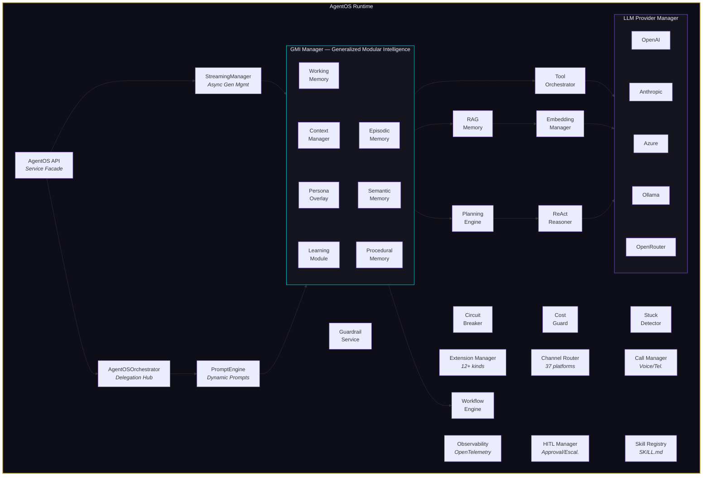
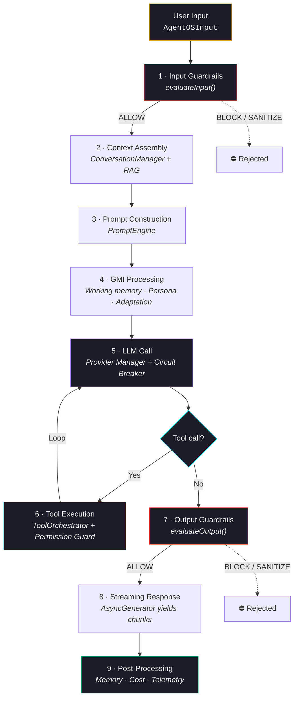
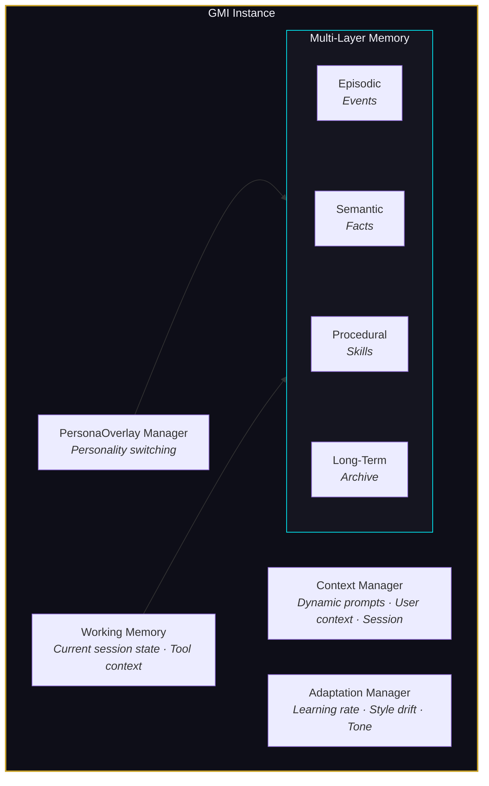
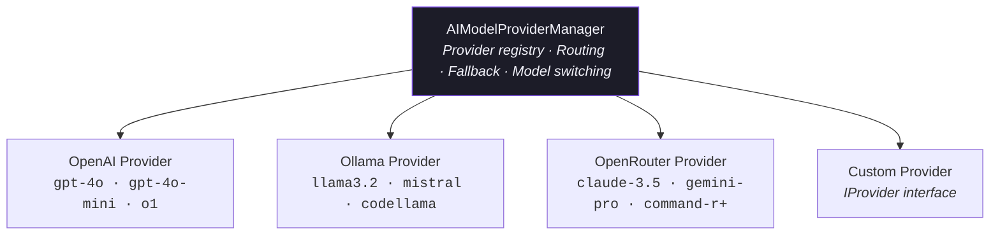
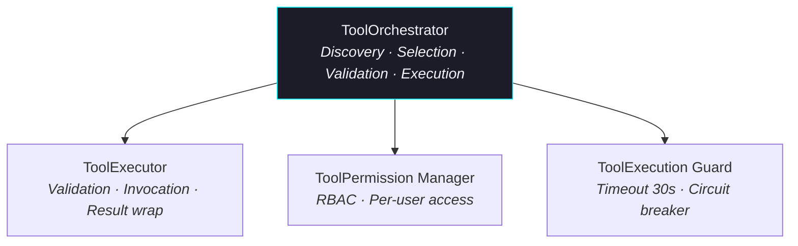
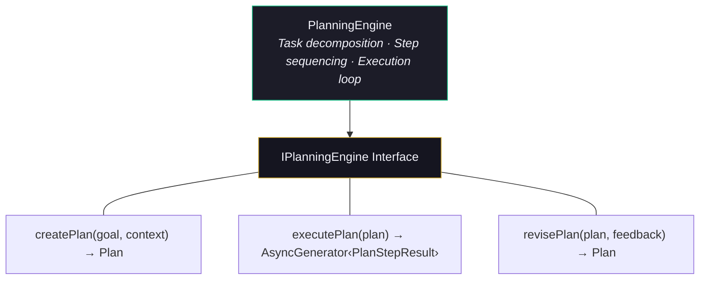
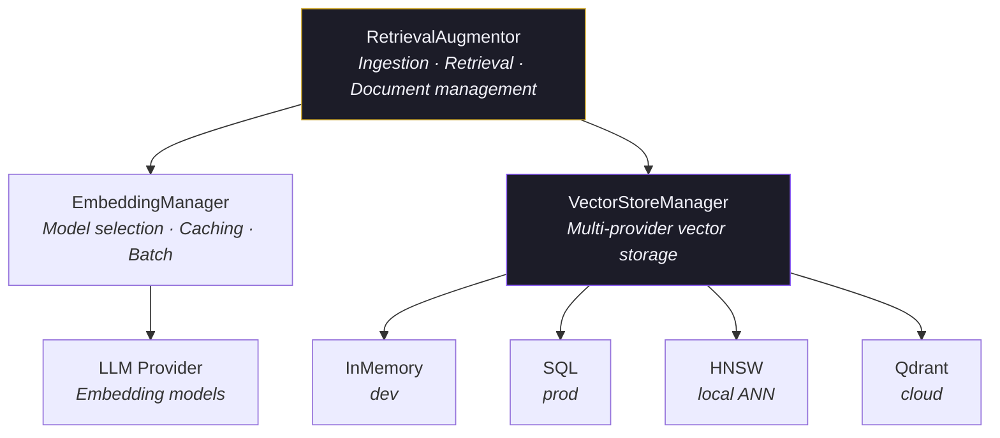
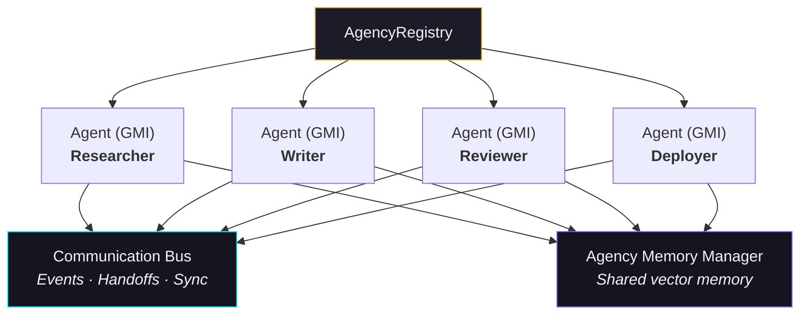

<div align="center">

<a href="https://agentos.sh">
  
</a>

# AgentOS

**TypeScript runtime for autonomous AI agents — multimodal RAG, cognitive memory, streaming guardrails, voice pipeline, and emergent multi-agent orchestration.**

[](https://www.npmjs.com/package/@framers/agentos)
[](https://github.com/framersai/agentos/actions)
[](https://codecov.io/gh/framersai/agentos)
[](https://www.typescriptlang.org/)
[](https://opensource.org/licenses/Apache-2.0)

[Website](https://agentos.sh) · [Documentation](https://docs.agentos.sh) · [npm](https://www.npmjs.com/package/@framers/agentos) · [GitHub](https://github.com/framersai/agentos)

</div>

---

## Table of Contents

- [Overview](#overview)
- [Quick Start](#quick-start)
  - [Multi-Agent Teams with agency()](#multi-agent-teams-with-agency)
  - [Single-Agent and Low-Level Helpers](#single-agent-and-low-level-helpers)
  - [Advanced: AgentGraph and Full Runtime](#advanced-agentgraph-and-full-runtime)
- [System Architecture](#system-architecture)
  - [Architecture Diagram](#architecture-diagram)
  - [Request Lifecycle](#request-lifecycle)
  - [Layer Breakdown](#layer-breakdown)
- [Core Modules](#core-modules)
  - [API Layer](#api-layer)
  - [Cognitive Substrate (GMI)](#cognitive-substrate-gmi)
  - [LLM Provider Management](#llm-provider-management)
  - [Tool System](#tool-system)
  - [Extension System](#extension-system)
  - [Planning Engine](#planning-engine)
  - [Conversation Management](#conversation-management)
  - [RAG (Retrieval Augmented Generation)](#rag-retrieval-augmented-generation)
  - [Safety and Guardrails](#safety-and-guardrails)
  - [Human-in-the-Loop (HITL)](#human-in-the-loop-hitl)
  - [Channels System](#channels-system)
  - [Voice and Telephony](#voice-and-telephony)
  - [Unified Orchestration Layer](#unified-orchestration-layer)
  - [Multi-Agent Coordination](#multi-agent-coordination)
  - [Observability](#observability)
  - [Skills](#skills)
  - [Structured Output](#structured-output)
- [Configuration](#configuration)
  - [Development (Quick Start)](#development-quick-start)
  - [Production](#production)
  - [Multiple Providers](#multiple-providers)
  - [Environment Variables](#environment-variables)
- [API Reference](#api-reference)
  - [AgentOS Class](#agentos-class)
  - [IAgentOS Interface](#iagentos-interface)
  - [AgentOSInput](#agentosinput)
  - [AgentOSResponse Streaming](#agentosresponse-streaming)
  - [ITool Interface](#itool-interface)
  - [ExtensionDescriptor](#extensiondescriptor)
  - [IGuardrailService](#iguardrailservice)
  - [IHumanInteractionManager](#ihumaninteractionmanager)
- [Usage Examples](#usage-examples)
  - [Orchestration Patterns](#orchestration-patterns)
  - [Streaming Chat](#streaming-chat)
  - [Adding Tools](#adding-tools)
  - [Multi-Agent Collaboration](#multi-agent-collaboration)
  - [Human-in-the-Loop Approvals](#human-in-the-loop-approvals)
  - [Structured Data Extraction](#structured-data-extraction)
  - [RAG Memory](#rag-memory)
  - [Custom Guardrails](#custom-guardrails)
  - [Channel Adapters](#channel-adapters)
  - [Voice Calls](#voice-calls)
- [Package Exports](#package-exports)
- [Internal Documentation](#internal-documentation)
- [Contributing](#contributing)
- [License](#license)

---

## Overview

`@framers/agentos` is an open-source TypeScript AI agent runtime for building, deploying, and managing production AI agents. It provides multimodal RAG with cognitive memory (Ebbinghaus decay), multi-agent orchestration, 37 channel adapters, 5-tier guardrails with prompt injection defense, 21 LLM providers, and 40 curated skills. Self-hostable and production-ready, it handles the full lifecycle from prompt construction through tool execution, safety evaluation, and streaming response delivery.

**Key facts:**

| Property | Value |
|----------|-------|
| Package | `@framers/agentos` |
| Language | TypeScript 5.4+ / Node.js 18+ |
| License | Apache 2.0 |

**Runtime dependencies:**

| Dependency | Purpose |
|------------|---------|
| `@opentelemetry/api` | Distributed tracing and metrics |
| `ajv` + `ajv-formats` | JSON Schema validation for tool I/O |
| `axios` | HTTP client for LLM provider APIs |
| `lru-cache` | High-performance caching (dedup, embeddings, cost tracking) |
| `natural` | NLP utilities (tokenization, stemming, sentiment) |
| `pino` | Structured JSON logging |
| `uuid` | Unique identifier generation |
| `yaml` | YAML config parsing (agent configs, skill definitions) |

**Optional peer dependencies:**

| Peer Dependency | Purpose |
|-----------------|---------|
| `@framers/sql-storage-adapter` | SQL-backed vector store and persistence |
| `graphology` + `graphology-communities-louvain` | GraphRAG community detection |
| `hnswlib-node` | HNSW-based approximate nearest neighbor search |
| `neo4j-driver` | Neo4j-backed vector + GraphRAG persistence |

---

## Ecosystem

| Package | Description | Links |
|---------|-------------|-------|
| **@framers/agentos** | Core orchestration runtime | [](https://www.npmjs.com/package/@framers/agentos) · [GitHub](https://github.com/framersai/agentos) |
| **@framers/agentos-extensions** | Official extension registry (45+ extensions) | [](https://www.npmjs.com/package/@framers/agentos-extensions) · [GitHub](https://github.com/framersai/agentos-extensions) |
| **@framers/agentos-extensions-registry** | Curated manifest builder | [](https://www.npmjs.com/package/@framers/agentos-extensions-registry) · [GitHub](https://github.com/framersai/agentos-extensions-registry) |
| **@framers/agentos-skills-registry** | 28+ curated SKILL.md files | [](https://www.npmjs.com/package/@framers/agentos-skills-registry) · [GitHub](https://github.com/framersai/agentos-skills-registry) |
| **@framers/agentos-skills** | Skills runtime loader (reads SKILL.md → agent prompt) | [](https://www.npmjs.com/package/@framers/agentos-skills) · [GitHub](https://github.com/framersai/agentos-skills) |
| **docs.agentos.sh** | Documentation site (Docusaurus) | [GitHub](https://github.com/framersai/agentos-live-docs) · [docs.agentos.sh](https://docs.agentos.sh) |

### Guardrail Extensions

| Package | What It Does | Links |
|---------|-------------|-------|
| **@framers/agentos-ext-pii-redaction** | Four-tier PII detection (regex + NLP + NER + LLM) | [](https://www.npmjs.com/package/@framers/agentos-ext-pii-redaction) · [Docs](https://docs.agentos.sh/extensions/built-in/pii-redaction) |
| **@framers/agentos-ext-ml-classifiers** | Toxicity, injection, jailbreak via ONNX BERT | [](https://www.npmjs.com/package/@framers/agentos-ext-ml-classifiers) · [Docs](https://docs.agentos.sh/extensions/built-in/ml-classifiers) |
| **@framers/agentos-ext-topicality** | Embedding-based topic enforcement + drift detection | [](https://www.npmjs.com/package/@framers/agentos-ext-topicality) · [Docs](https://docs.agentos.sh/extensions/built-in/topicality) |
| **@framers/agentos-ext-code-safety** | OWASP Top 10 code scanning (25 regex rules) | [](https://www.npmjs.com/package/@framers/agentos-ext-code-safety) · [Docs](https://docs.agentos.sh/extensions/built-in/code-safety) |
| **@framers/agentos-ext-grounding-guard** | RAG-grounded hallucination detection via NLI | [](https://www.npmjs.com/package/@framers/agentos-ext-grounding-guard) · [Docs](https://docs.agentos.sh/extensions/built-in/grounding-guard) |

---

## Quick Start

```bash
npm install @framers/agentos
```

**Requirements:** Node.js 18+ and TypeScript 5.0+

**Start here:**

- Use [`agency()`](./docs/AGENCY_API.md) to coordinate a team of agents with a single call.
- Use [`generateText()` / `streamText()` / `generateImage()` / `agent()`](./docs/HIGH_LEVEL_API.md) for the fastest path from prompt to working code.
- Use [`AgentOS`](#advanced-agentgraph-and-full-runtime) when you need extensions, workflows, personas, or full runtime lifecycle control.
- Browse the live docs at [docs.agentos.sh/getting-started/high-level-api](https://docs.agentos.sh/getting-started/high-level-api) and [docs.agentos.sh/api](https://docs.agentos.sh/api).

### Multi-Agent Teams with `agency()`

`agency()` is the recommended starting point for any task that benefits from
multiple specialised agents.  Three lines to go from prompt to a coordinated
research-and-writing pipeline:

```typescript
import { agency } from '@framers/agentos';

const team = agency({
  agents: {
    researcher: { instructions: 'Find relevant facts.' },
    writer:     { instructions: 'Write a clear, concise summary.' },
  },
  strategy: 'sequential',
});

const result = await team.generate('Summarise recent advances in fusion energy.');
console.log(result.text);
```

Set `OPENAI_API_KEY` (or another provider's key) and the agency auto-detects the
provider.  All five strategies are available out of the box:

| Strategy | What it does |
|---|---|
| `sequential` | Agents run in order; each receives the previous output as context |
| `parallel` | All agents run concurrently; results are merged by a synthesis step |
| `debate` | Agents argue and refine a shared answer over multiple rounds |
| `review-loop` | One agent drafts, another reviews and requests revisions |
| `hierarchical` | A coordinator dispatches sub-tasks to specialist agents at runtime |
| `graph` | Explicit dependency DAG via `dependsOn`; tiers run concurrently |

**Graph strategy** — declare dependencies between agents and let the orchestrator
handle topological ordering and concurrent execution:

```typescript
const team = agency({
  agents: {
    researcher:  { instructions: 'Research the topic.' },
    writer:      { instructions: 'Write an article.',       dependsOn: ['researcher'] },
    illustrator: { instructions: 'Describe illustrations.', dependsOn: ['researcher'] },
    reviewer:    { instructions: 'Review everything.',      dependsOn: ['writer', 'illustrator'] },
  },
  strategy: 'graph', // auto-detected when any agent has dependsOn
});
```

Add guardrails, HITL, resource controls, observability, `listen()` for voice
transport, `connect()` for channel adapters, RAG context injection, and real
per-agent stream events in the same config object — see
[`docs/AGENCY_API.md`](./docs/AGENCY_API.md) for the full reference.

### Single-Agent and Low-Level Helpers

Use the streamlined helpers when you want AI SDK-style text generation, image
generation, or a single stateful session without a multi-agent team.

```typescript
import { agent, generateImage, generateText, streamText } from '@framers/agentos';

// Provider-first: AgentOS picks the best default model automatically.
// Requires OPENAI_API_KEY (or the matching env var) to be set.
const quick = await generateText({
  provider: 'openai',
  prompt: 'Explain how TCP handshakes work in 3 bullets.',
});

console.log(quick.text);

const live = streamText({
  provider: 'openai',
  prompt: 'Stream a short explanation of SYN, SYN-ACK, ACK.',
});

for await (const delta of live.textStream) {
  process.stdout.write(delta);
}

const image = await generateImage({
  provider: 'openai',
  prompt: 'A cinematic neon city skyline reflected in rain at night.',
});

console.log(image.images[0]?.mimeType);

const assistant = agent({
  provider: 'openai',
  instructions: 'You are a concise networking tutor.',
  maxSteps: 3,
});

const session = assistant.session('tcp-demo');
const reply = await session.send('Now compare TCP and UDP.');
console.log(reply.text);
console.log(await session.usage());

// Legacy format — still supported:
// const result = await generateText({ model: 'openai:gpt-4o', prompt: '...' });
```

If you want durable helper-level usage accounting outside the full runtime, enable
the opt-in usage ledger:

```typescript
import { generateText, getRecordedAgentOSUsage } from '@framers/agentos';

await generateText({
  provider: 'openai',
  prompt: 'Explain HTTP keep-alive.',
  usageLedger: { enabled: true, sessionId: 'readme-demo' },
});

console.log(await getRecordedAgentOSUsage({ enabled: true, sessionId: 'readme-demo' }));
```

With `enabled: true`, AgentOS writes to the shared home ledger at `~/.framers/usage-ledger.jsonl` unless you provide `usageLedger.path` or one of the ledger env vars.

Built-in image providers: `openai`, `openrouter`, `stability`, and `replicate`.

Use `providerOptions` when you need provider-native controls without leaving the high-level API:

```typescript
const poster = await generateImage({
  model: 'stability:stable-image-core',
  prompt: 'An art deco travel poster for a moon colony',
  negativePrompt: 'text, watermark',
  providerOptions: {
    stability: {
      stylePreset: 'illustration',
      seed: 42,
      cfgScale: 8,
    },
  },
});
```

Runnable examples: [`examples/high-level-api.mjs`](./examples/high-level-api.mjs), [`examples/generate-image.mjs`](./examples/generate-image.mjs)

### Advanced: AgentGraph and Full Runtime

Use `AgentGraph` or the full `AgentOS` runtime when you need programmatic graph
construction with custom edge callbacks, extensions, workflow DSL, personas,
chunk-level streaming events, or full runtime lifecycle control.

```typescript
import { AgentOS, AgentOSResponseChunkType } from '@framers/agentos';
import { createTestAgentOSConfig } from '@framers/agentos/config/AgentOSConfig';

const agent = new AgentOS();
await agent.initialize(await createTestAgentOSConfig());

for await (const chunk of agent.processRequest({
  userId: 'user-1',
  sessionId: 'session-1',
  textInput: 'Explain how TCP handshakes work',
})) {
  if (chunk.type === AgentOSResponseChunkType.TEXT_DELTA) {
    process.stdout.write(chunk.textDelta);
  }
}
```

See [`docs/AGENT_GRAPH.md`](./docs/AGENT_GRAPH.md) for the `AgentGraph` programmatic
graph builder and [`docs/WORKFLOW_DSL.md`](./docs/WORKFLOW_DSL.md) for the workflow
DSL.

---

## System Architecture

### Architecture Diagram



### Request Lifecycle

A single `processRequest()` call flows through these stages:



### Layer Breakdown

AgentOS is organized into six architectural layers:

| Layer | Directory | Purpose |
|-------|-----------|---------|
| **API** | `src/api/` | Public-facing facade, input/output types, orchestrator |
| **Cognitive** | `src/cognitive_substrate/` | GMI instances, persona overlays, multi-layer memory |
| **Core** | `src/core/` | 28 subdirectories: LLM, tools, safety, guardrails, planning, workflows, HITL, observability, etc. |
| **Integration** | `src/channels/`, `src/voice/`, `src/extensions/` | External platform adapters, telephony, plugin system |
| **Intelligence** | `src/rag/`, `src/skills/` | RAG pipeline, GraphRAG, skill loading |
| **Infrastructure** | `src/config/`, `src/logging/`, `src/utils/`, `src/types/` | Configuration, structured logging, shared utilities |

---

## Core Modules

### API Layer

**Location:** `src/api/`

The API layer is the primary entry point for all interactions with AgentOS.

| File | Role |
|------|------|
| `AgentOS.ts` | Main service facade (1000+ lines). Implements `IAgentOS`. Initializes all subsystems and delegates to the orchestrator. |
| `AgentOSOrchestrator.ts` | Delegation hub. Coordinates GMI processing, tool execution, guardrail evaluation, and streaming assembly. Streaming-first design using async generators. |
| `interfaces/IAgentOS.ts` | Core contract defining `initialize()`, `processRequest()`, `handleToolResult()`, workflow management, persona listing, and conversation history retrieval. |
| `types/AgentOSInput.ts` | Unified input structure: text, vision, audio, persona selection, user API keys, feedback, workflow/agency invocations, and processing options. |
| `types/AgentOSResponse.ts` | Streaming output: 11 chunk types covering text deltas, tool calls, progress, errors, workflows, agency updates, and provenance events. |

**Response chunk types:**

```typescript
enum AgentOSResponseChunkType {
  TEXT_DELTA           // Incremental text tokens
  SYSTEM_PROGRESS      // Internal processing updates
  TOOL_CALL_REQUEST    // Agent requests tool execution
  TOOL_RESULT_EMISSION // Tool execution result
  UI_COMMAND           // Client-side UI directives
  FINAL_RESPONSE       // Aggregated final response
  ERROR                // Error information
  METADATA_UPDATE      // Session/context metadata changes
  WORKFLOW_UPDATE      // Workflow progress notifications
  AGENCY_UPDATE        // Multi-agent coordination events
  PROVENANCE_EVENT     // Immutability/audit trail events
}
```

---

### Cognitive Substrate (GMI)

**Location:** `src/cognitive_substrate/`

The Generalized Modular Intelligence (GMI) is the core agent instance -- the "brain" of each agent. A single AgentOS runtime can manage multiple GMI instances via `GMIManager`.



**Key components:**

- **GMI.ts** -- Core agent instance (2000+ lines). Manages the complete cognitive loop: context assembly, prompt construction, LLM invocation, tool handling, and response generation.
- **GMIManager.ts** -- Lifecycle manager for multiple GMI instances. Handles creation, pooling, configuration, and teardown.
- **IGMI.ts** -- Interface contract for GMI implementations.
- **PersonaOverlayManager** -- Enables dynamic personality switching at runtime. Ships with 5+ built-in personas:
  - `Researcher` -- Analytical, citation-heavy responses
  - `Generalist` -- Balanced, conversational
  - `Atlas` -- Navigation and spatial reasoning
  - `Default Assistant` -- General-purpose helpful assistant
- **Memory subsystem** (`memory/`) -- Four-layer memory architecture:
  - **Working memory** -- Current session state, active tool context, conversation buffer
  - **Episodic memory** -- Timestamped events and interactions
  - **Semantic memory** -- Extracted facts, entity relationships, domain knowledge
  - **Procedural memory** -- Learned skills, patterns, and execution strategies

---

### LLM Provider Management

**Location:** `src/core/llm/`

The LLM layer abstracts multiple AI model providers behind a unified interface.



**Provider implementations:**

| Provider | File | Models |
|----------|------|--------|
| OpenAI | `providers/implementations/OpenAIProvider.ts` | GPT-4o, GPT-4o-mini, o1, o3, etc. |
| Ollama | `providers/implementations/OllamaProvider.ts` | Any locally-hosted model (Llama, Mistral, etc.) |
| OpenRouter | `providers/implementations/OpenRouterProvider.ts` | 200+ models from any provider via unified API |

> **Note:** Anthropic (Claude) and Google Gemini are supported at the **Wunderland runtime** level via their respective APIs. In AgentOS, use OpenRouter to access these models, or use Wunderland's higher-level `createWunderlandSeed()` API which handles provider routing natively.

**Additional components:**

- **PromptEngine** (`PromptEngine.ts`) -- Constructs prompts from system instructions, contextual elements, persona definitions, and dynamic user context. Supports template interpolation and conditional element inclusion.
- **IProvider** (`providers/IProvider.ts`) -- Interface contract for adding custom LLM providers.
- **Streaming adapters** -- All providers support token-level streaming via async generators with backpressure control.

**Per-request model override:**

```typescript
for await (const chunk of agent.processRequest({
  userId: 'user-1',
  sessionId: 'session-1',
  textInput: 'Summarize this document',
  options: {
    preferredProviderId: 'anthropic',
    preferredModelId: 'claude-sonnet-4-5-20250929',
  },
})) { /* ... */ }
```

---

### Tool System

**Location:** `src/core/tools/`

Tools are the primary mechanism for agents to interact with the outside world. Every tool implements the `ITool` interface.



**ITool interface (abbreviated):**

```typescript
interface ITool<TInput = any, TOutput = any> {
  readonly id: string;              // Globally unique identifier
  readonly name: string;            // LLM-facing function name
  readonly displayName: string;     // Human-readable title
  readonly description: string;     // Natural language description for LLM
  readonly inputSchema: JSONSchemaObject;   // JSON Schema for input validation
  readonly outputSchema?: JSONSchemaObject; // JSON Schema for output validation
  readonly category?: string;       // Grouping (e.g., "data_analysis")
  readonly hasSideEffects: boolean; // Whether the tool modifies external state
  readonly requiredCapabilities?: string[]; // Persona capabilities needed

  execute(
    args: TInput,
    context?: ToolExecutionContext
  ): Promise<ToolExecutionResult<TOutput>>;
}
```

**ToolExecutionResult:**

```typescript
interface ToolExecutionResult<TOutput = any> {
  success: boolean;
  output?: TOutput;
  error?: string;
  contentType?: string;  // MIME type (default: "application/json")
  details?: Record<string, any>;
}
```

**ToolExecutionContext** provides the tool with calling agent identity (`gmiId`, `personaId`), user context, correlation ID for tracing, and optional session data.

---

### Extension System

**Location:** `src/extensions/`

The extension system is AgentOS's plugin architecture. Extensions are packaged as **packs** containing one or more **descriptors**, loaded via a **manifest**.

```
ExtensionManifest
    |
    +-- ExtensionPackManifestEntry[]
            |
            +-- ExtensionPack (resolved via factory/module/package)
                    |
                    +-- ExtensionDescriptor[] (id + kind + payload)
                            |
                            +-- Registered in ExtensionRegistry
                                    |
                                    +-- Consumed by runtime (ToolOrchestrator,
                                        GuardrailService, WorkflowEngine, etc.)
```

**12 extension kinds:**

| Kind Constant | Value | Payload Type |
|---------------|-------|--------------|
| `EXTENSION_KIND_TOOL` | `"tool"` | `ITool` |
| `EXTENSION_KIND_GUARDRAIL` | `"guardrail"` | `IGuardrailService` |
| `EXTENSION_KIND_RESPONSE_PROCESSOR` | `"response-processor"` | Response transform function |
| `EXTENSION_KIND_WORKFLOW` | `"workflow"` | `WorkflowDescriptorPayload` |
| `EXTENSION_KIND_WORKFLOW_EXECUTOR` | `"workflow-executor"` | Workflow step executor |
| `EXTENSION_KIND_PERSONA` | `"persona"` | `IPersonaDefinition` |
| `EXTENSION_KIND_PLANNING_STRATEGY` | `"planning-strategy"` | Planning algorithm |
| `EXTENSION_KIND_HITL_HANDLER` | `"hitl-handler"` | Human interaction handler |
| `EXTENSION_KIND_COMM_CHANNEL` | `"communication-channel"` | Agent-to-agent channel |
| `EXTENSION_KIND_MEMORY_PROVIDER` | `"memory-provider"` | Memory backend |
| `EXTENSION_KIND_MESSAGING_CHANNEL` | `"messaging-channel"` | External platform adapter |
| `EXTENSION_KIND_PROVENANCE` | `"provenance"` | Audit/immutability handler |

**ExtensionDescriptor:**

```typescript
interface ExtensionDescriptor<TPayload = unknown> {
  id: string;                           // Unique within its kind
  kind: ExtensionKind;                  // One of the 12 kinds above
  priority?: number;                    // Higher loads later (overrides earlier)
  enableByDefault?: boolean;            // Auto-enable on discovery
  metadata?: Record<string, unknown>;   // Arbitrary metadata
  payload: TPayload;                    // The actual implementation
  source?: ExtensionSourceMetadata;     // Provenance (package name, version)
  requiredSecrets?: ExtensionSecretRequirement[]; // API keys needed
  onActivate?: (ctx: ExtensionLifecycleContext) => Promise<void> | void;
  onDeactivate?: (ctx: ExtensionLifecycleContext) => Promise<void> | void;
}
```

**ExtensionManifest:**

```typescript
interface ExtensionManifest {
  packs: ExtensionPackManifestEntry[];  // Pack references
  overrides?: ExtensionOverrides;       // Per-descriptor enable/disable/priority
}

// Packs can be resolved three ways:
type ExtensionPackResolver =
  | { package: string; version?: string }  // npm package
  | { module: string }                     // Local module path
  | { factory: () => Promise<ExtensionPack> | ExtensionPack }; // Inline factory
```

**Loading pipeline:**

1. `ExtensionLoader` resolves pack entries from the manifest
2. `ExtensionRegistry` registers descriptors by kind, applying priority stacking
3. `ExtensionManager` provides runtime access: `getTools()`, `getGuardrails()`, `getWorkflows()`, etc.
4. `MultiRegistryLoader` supports loading from multiple remote registries

**Lifecycle context and shared services:**

- `ExtensionLifecycleContext.getSecret(secretId)` gives packs host-resolved secrets at activation time
- `ExtensionLifecycleContext.services` provides a shared `ISharedServiceRegistry` for lazy singleton reuse across packs
- heavyweight dependencies such as NLP pipelines, ONNX models, embedding functions, and NLI models should be loaded through the shared registry rather than per-descriptor globals

**Built-in guardrail packs exported by `@framers/agentos`:**

| Pack | Import Path | Guardrail ID | Tool IDs | Purpose |
|------|-------------|--------------|----------|---------|
| PII Redaction | `@framers/agentos-ext-pii-redaction` | `pii-redaction-guardrail` | `pii_scan`, `pii_redact` | Four-tier PII detection and redaction |
| ML Classifiers | `@framers/agentos-ext-ml-classifiers` | `ml-classifier-guardrail` | `classify_content` | Toxicity, prompt-injection, and jailbreak detection |
| Topicality | `@framers/agentos-ext-topicality` | `topicality-guardrail` | `check_topic` | On-topic enforcement and session drift detection |
| Code Safety | `@framers/agentos-ext-code-safety` | `code-safety-guardrail` | `scan_code` | Regex-based code risk scanning across fenced code and tool args |
| Grounding Guard | `@framers/agentos-ext-grounding-guard` | `grounding-guardrail` | `check_grounding` | RAG-source claim verification and hallucination detection |

---

### Planning Engine

**Location:** `src/core/planning/`

The planning engine enables multi-step task decomposition and execution using ReAct (Reasoning + Acting) patterns.



Plans are composed of typed steps that the agent executes sequentially, with the ability to revise the plan based on intermediate results. The planning engine integrates with:

- **Tool system** for action execution
- **Guardrails** for step-level safety checks
- **HITL** for human approval of high-risk steps
- **Memory** for persisting plan state across sessions

See [`docs/PLANNING_ENGINE.md`](docs/PLANNING_ENGINE.md) for the full planning system specification.

---

### Conversation Management

**Location:** `src/core/conversation/`

Manages session state, message history, and long-term memory persistence.

- **ConversationManager** -- Creates and retrieves conversation contexts, manages rolling message windows, and coordinates memory persistence.
- **ConversationContext** -- Immutable snapshot of a conversation: messages, metadata, active persona, user context.
- **IRollingSummaryMemorySink** -- Interface for persisting conversation summaries that compress long conversations into retrievable memory.
- **ILongTermMemoryRetriever** -- Interface for retrieving relevant past conversations during context assembly.

---

### RAG (Retrieval Augmented Generation)

**Location:** `src/rag/`

A complete RAG pipeline with pluggable vector stores, embedding management, and document ingestion.



**Vector store implementations:**

| Store | Import | Use Case |
|-------|--------|----------|
| `InMemoryVectorStore` | `@framers/agentos/rag` | Development and testing |
| `SqlVectorStore` | `@framers/agentos/rag` | Production (SQLite/Postgres via `@framers/sql-storage-adapter`) |
| `HnswlibVectorStore` | `@framers/agentos/rag` | High-performance local ANN search |
| `QdrantVectorStore` | `@framers/agentos/rag` | Cloud-hosted vector database |
| `Neo4jVectorStore` | `@framers/agentos/rag` | Neo4j 5.x native vector indexes with shared connection pooling |

> **Database Persistence: [`@framers/sql-storage-adapter`](https://github.com/framersai/sql-storage-adapter)**
>
> All SQL-backed storage in AgentOS — including `SqlVectorStore`, conversation persistence, and memory archival — is powered by the `@framers/sql-storage-adapter` package. It provides a unified interface across 7 database backends with automatic runtime detection:
>
> | Adapter | Runtime | Use Case |
> |---------|---------|----------|
> | `better-sqlite3` | Node.js | Production (default) |
> | `pg` | Node.js | PostgreSQL for cloud deployments |
> | `sql.js` | Browser/WASM | Client-side storage |
> | `capacitor` | Mobile | iOS/Android via Capacitor |
> | `electron` | Desktop | Electron apps with IPC bridge |
> | `indexeddb` | Browser | Fallback browser storage |
> | `memory` | Any | Testing and development |
>
> ```typescript
> import { createDatabase } from '@framers/sql-storage-adapter';
> const db = await createDatabase(); // auto-detects best adapter
> ```

**GraphRAG:**

AgentOS supports both in-memory `GraphRAGEngine` and persistent `Neo4jGraphRAGEngine` (at `src/rag/graphrag/`) for knowledge-graph-enhanced retrieval:

- Entity and relationship extraction from documents
- Community detection via Louvain algorithm (requires `graphology` peer dependency)
- Local search (entity-centric) and global search (community-summarized)
- Hybrid retrieval combining vector similarity with graph traversal

```typescript
import { GraphRAGEngine } from '@framers/agentos/rag/graphrag';
import { Neo4jGraphRAGEngine } from '@framers/agentos/rag/graphrag';
import type { GraphRAGConfig, GraphEntity, GraphRelationship } from '@framers/agentos/rag/graphrag';
```

See [`docs/RAG_MEMORY_CONFIGURATION.md`](docs/RAG_MEMORY_CONFIGURATION.md) and [`docs/MULTIMODAL_RAG.md`](docs/MULTIMODAL_RAG.md) for detailed configuration guides.

---

### Safety and Guardrails

**Location:** `src/core/safety/` and `src/core/guardrails/`

AgentOS provides defense-in-depth safety through two complementary systems.

#### Safety Primitives (`core/safety/`)

Five runtime safety components:

| Component | Export | Purpose |
|-----------|--------|---------|
| **CircuitBreaker** | `CircuitBreaker` | Three-state (closed/open/half-open) wrapper for LLM calls. Configurable failure threshold, reset timeout, and half-open probe count. Throws `CircuitOpenError` when tripped. |
| **ActionDeduplicator** | `ActionDeduplicator` | Hash-based recent action tracking with LRU eviction. Prevents redundant tool calls and repeated operations within a configurable time window. |
| **StuckDetector** | `StuckDetector` | Detects three patterns: repeated outputs, repeated errors, and oscillation (A-B-A-B cycles). Returns `StuckDetection` with reason and confidence. |
| **CostGuard** | `CostGuard` | Per-agent session and daily spending caps. Defaults: $1/session, $5/day. Throws `CostCapExceededError` when limits are hit. Tracks token usage across all LLM calls. |
| **ToolExecutionGuard** | `ToolExecutionGuard` | Per-tool timeout (30s default) with independent circuit breakers per tool ID. Reports `ToolHealthReport` for monitoring. Throws `ToolTimeoutError`. |

```typescript
import {
  CircuitBreaker,
  CostGuard,
  StuckDetector,
  ActionDeduplicator,
  ToolExecutionGuard,
} from '@framers/agentos/core/safety';
```

See [`docs/SAFETY_PRIMITIVES.md`](docs/SAFETY_PRIMITIVES.md) for the full safety API reference.

#### Guardrails (`core/guardrails/`)

Content-level input/output filtering:

```typescript
interface IGuardrailService {
  config?: {
    evaluateStreamingChunks?: boolean;
    maxStreamingEvaluations?: number;
    canSanitize?: boolean;
    timeoutMs?: number;
  };

  evaluateInput?(payload: GuardrailInputPayload): Promise<GuardrailEvaluationResult | null>;
  evaluateOutput?(payload: GuardrailOutputPayload): Promise<GuardrailEvaluationResult | null>;
}
```

`GuardrailOutputPayload` also carries `ragSources?: RagRetrievedChunk[]`, which enables grounding-aware output checks against retrieved context.

Guardrails run at two points in the request lifecycle:
1. **Pre-processing** -- `evaluateInput()` inspects user input before orchestration
2. **Post-processing** -- `evaluateOutput()` inspects streaming chunks and/or the final response before emission

When multiple guardrails are registered, AgentOS uses a **two-phase dispatcher**:
1. **Phase 1 (sequential sanitizers)** -- guardrails with `config.canSanitize === true` run in registration order so each sanitizer sees the cumulative sanitized text
2. **Phase 2 (parallel classifiers)** -- all remaining guardrails run concurrently with worst-action aggregation (`BLOCK > FLAG > ALLOW`)

`ParallelGuardrailDispatcher` powers both input evaluation and output stream wrapping, with per-guardrail `timeoutMs` fail-open behavior for slow or degraded classifiers.

Multiple guardrails can be composed via the extension system, and each receives full context (user ID, session ID, persona ID, conversation ID, metadata) for context-aware policy decisions.

See [`docs/GUARDRAILS_USAGE.md`](docs/GUARDRAILS_USAGE.md) for implementation patterns.

---

### Human-in-the-Loop (HITL)

**Location:** `src/core/hitl/`

The HITL system enables agents to request human approval, clarification, and collaboration at key decision points.

**Core interface: `IHumanInteractionManager`**

Three interaction modes:

| Mode | Method | Use Case |
|------|--------|----------|
| **Approval** | `requestApproval()` | Gate high-risk actions (database mutations, financial operations, external communications) |
| **Clarification** | `requestClarification()` | Ask the user for missing information before proceeding |
| **Escalation** | `escalateToHuman()` | Hand off to a human operator when the agent cannot proceed |

**PendingAction structure:**

```typescript
interface PendingAction {
  actionId: string;
  description: string;
  severity: 'low' | 'medium' | 'high' | 'critical';
  category?: 'data_modification' | 'external_api' | 'financial' |
             'communication' | 'system' | 'other';
  agentId: string;
  context: Record<string, unknown>;
  potentialConsequences?: string[];
  reversible: boolean;
  estimatedCost?: { amount: number; currency: string };
  timeoutMs?: number;
  alternatives?: AlternativeAction[];
}
```

HITL integrates with the planning engine so individual plan steps can require approval, and with the extension system via `EXTENSION_KIND_HITL_HANDLER` for custom approval UIs.

See [`docs/HUMAN_IN_THE_LOOP.md`](docs/HUMAN_IN_THE_LOOP.md) for the full HITL specification.

---

### Channels System

**Location:** `src/channels/`

Unified adapters for 40 external messaging and social platforms.

**40 supported platforms:**

| Priority | Platforms |
|----------|-----------|
| **P0** (Core + Social) | Telegram, WhatsApp, Discord, Slack, Webchat, Twitter/X, Instagram, Reddit, YouTube, LinkedIn, Facebook, Threads, Bluesky |
| **P1** | Signal, iMessage, Google Chat, Microsoft Teams, Pinterest, TikTok, Mastodon, Dev.to, Hashnode, Medium, WordPress |
| **P2** | Matrix, Zalo, Email, SMS, Farcaster, Lemmy, Google Business |
| **P3** | Nostr, Twitch, Line, Feishu, Mattermost, Nextcloud Talk, Tlon, IRC, Zalo Personal |

**29 capability flags:**

Each adapter declares its capabilities, allowing consumers to check before attempting unsupported actions:

```
text, rich_text, images, video, audio, voice_notes, documents,
stickers, reactions, threads, typing_indicator, read_receipts,
group_chat, channels, buttons, inline_keyboard, embeds,
mentions, editing, deletion
stories, reels, hashtags, polls, carousel,
engagement_metrics, scheduling, dm_automation, content_discovery
```

**IChannelAdapter** -- Unified interface for bidirectional messaging:

- `connect()` / `disconnect()` -- Lifecycle management
- `sendMessage()` -- Outbound messages with platform-specific formatting
- `onMessage()` -- Inbound message handler registration
- `getConnectionInfo()` -- Connection health monitoring
- `capabilities` -- Declared capability set

**ChannelRouter** -- Routes inbound messages to the appropriate agent and outbound responses to the correct platform adapter. Supports multi-platform agents (one agent, many channels).

**Connection status:** `disconnected` -> `connecting` -> `connected` -> `reconnecting` -> `error`

Channel adapters are registered as extensions via `EXTENSION_KIND_MESSAGING_CHANNEL`.

See [`docs/PLATFORM_SUPPORT.md`](docs/PLATFORM_SUPPORT.md) for platform-specific configuration.

---

### Voice and Telephony

**Location:** `src/voice/`

Enable agents to make and receive phone calls via telephony providers.

**Call state machine:**

```
initiated --> ringing --> answered --> active --> speaking <--> listening
    |            |           |          |            |            |
    +------------+-----------+----------+------------+------------+
    |                    (any non-terminal state)                 |
    v
[Terminal States]
completed | hangup-user | hangup-bot | timeout | error |
failed | no-answer | busy | voicemail
```

**Providers:**

| Provider | Support |
|----------|---------|
| Twilio | Full voice + SMS |
| Telnyx | Full voice |
| Plivo | Full voice |
| Mock | Testing/development |

**Key components:**

- **CallManager** -- Manages call lifecycle, state transitions, and event dispatch
- **IVoiceCallProvider** -- Interface for telephony provider adapters
- **telephony-audio.ts** -- Audio stream handling and format conversion

Voice providers are registered via `EXTENSION_KIND_TOOL` with the `voice-call-provider` category.

---

### Unified Orchestration Layer

**Location:** `src/orchestration/`

Three authoring APIs compile to one `CompiledExecutionGraph` IR executed by a single `GraphRuntime`. Persistent checkpointing enables time-travel debugging and fault recovery.

Current status: the builders, IR, checkpoints, and base runtime are real. Some advanced routes are still partial in the shared runtime: discovery edges need discovery wiring, personality edges need a trait source, and `extension` / `subgraph` execution still requires a higher-level bridge runtime.

| API | Level | Use case |
|-----|-------|----------|
| **`AgentGraph`** | Low-level | Explicit nodes, edges, cycles, subgraphs — full graph control |
| **`workflow()`** | Mid-level | Deterministic DAG chains with step/branch/parallel — Zod-typed I/O |
| **`mission()`** | High-level | Intent-driven — declare goal + constraints, PlanningEngine decides steps |

**Differentiators vs LangGraph / Mastra:** memory-aware state, capability discovery routing, personality-driven edges, inter-step guardrails, streaming at every node transition.

```typescript
import { AgentGraph, toolNode, gmiNode, START, END } from '@framers/agentos/orchestration';
import { z } from 'zod';

// Low-level: explicit graph with checkpoints
const graph = new AgentGraph({
  input: z.object({ topic: z.string() }),
  scratch: z.object({ draft: z.string().optional() }),
  artifacts: z.object({ status: z.string().optional(), summary: z.string().optional() }),
})
  .addNode('draft', gmiNode({ instructions: 'Draft a concise summary', executionMode: 'single_turn' }))
  .addNode('publish', toolNode('publish_report'))
  .addEdge(START, 'draft')
  .addEdge('draft', 'publish')
  .addEdge('publish', END)
  .compile();

const result = await graph.invoke({ topic: 'quantum computing' });

// Mid-level: deterministic workflow
import { workflow } from '@framers/agentos/orchestration';

const flow = workflow('onboarding')
  .input(z.object({ email: z.string() }))
  .returns(z.object({ userId: z.string() }))
  .step('validate', { tool: 'email_validator' })
  .then('create', { tool: 'user_service' })
  .compile();

// High-level: intent-driven
import { mission } from '@framers/agentos/orchestration';

const researcher = mission('research')
  .input(z.object({ topic: z.string() }))
  .goal('Research {topic} and produce a cited summary')
  .returns(z.object({ summary: z.string() }))
  .planner({ strategy: 'plan_and_execute', maxSteps: 8 })
  .compile();

const plan = await researcher.explain({ topic: 'AI safety' }); // preview plan without executing
```

See [`docs/UNIFIED_ORCHESTRATION.md`](docs/UNIFIED_ORCHESTRATION.md), [`docs/AGENT_GRAPH.md`](docs/AGENT_GRAPH.md), [`docs/WORKFLOW_DSL.md`](docs/WORKFLOW_DSL.md), [`docs/MISSION_API.md`](docs/MISSION_API.md), [`docs/CHECKPOINTING.md`](docs/CHECKPOINTING.md).

Runnable examples: [`examples/agent-graph.mjs`](./examples/agent-graph.mjs), [`examples/workflow-dsl.mjs`](./examples/workflow-dsl.mjs), [`examples/mission-api.mjs`](./examples/mission-api.mjs)

#### Legacy WorkflowEngine

The original `WorkflowEngine` (`src/core/workflows/`) continues to work for existing consumers. The new orchestration layer is opt-in and runs alongside it.

```typescript
const definitions = agent.listWorkflowDefinitions();
const instance = await agent.startWorkflow('data-pipeline-v1', input);
const status = await agent.getWorkflow(instance.workflowId);
```

---

### Multi-Agent Coordination

**Location:** `src/core/agency/`

Enables teams of agents to collaborate on shared goals.

- **AgencyRegistry** -- Register and manage agent teams with role assignments
- **AgentCommunicationBus** -- Inter-agent message passing with typed events and handoffs
- **AgencyMemoryManager** -- Shared memory space with vector search for agency-wide knowledge



See [`docs/AGENT_COMMUNICATION.md`](docs/AGENT_COMMUNICATION.md) for the full multi-agent specification.

---

### Observability

**Location:** `src/core/observability/`

OpenTelemetry-native observability for tracing, metrics, and cost tracking.

- **ITracer** / **Tracer** -- Span creation and propagation for distributed tracing
- **otel.ts** -- `configureAgentOSObservability()` sets up the OpenTelemetry SDK with custom exporters
- **Metrics** -- Token usage, latency percentiles, tool execution counts, error rates
- **Cost tracking** -- Per-request and aggregate cost computation across providers

```typescript
import { configureAgentOSObservability } from '@framers/agentos';

configureAgentOSObservability({
  serviceName: 'my-agent',
  traceExporter: myOTLPExporter,
  metricExporter: myMetricsExporter,
});
```

See [`docs/OBSERVABILITY.md`](docs/OBSERVABILITY.md) and [`docs/COST_OPTIMIZATION.md`](docs/COST_OPTIMIZATION.md) for setup guides.

---

### Skills

**Location:** `src/skills/`

Skills are portable, self-describing agent capabilities defined in `SKILL.md` files.

- **SkillRegistry** -- Discovers and registers available skills
- **SkillLoader** -- Parses SKILL.md format (YAML frontmatter + markdown body)
- **SKILL.md format** -- Declarative skill definition with name, description, required tools, and behavioral instructions

See [`docs/SKILLS.md`](docs/SKILLS.md) for the skill authoring guide.

---

### Structured Output

**Location:** `src/core/structured/`

Extract typed, validated data from unstructured text using JSON Schema.

- **StructuredOutputManager** -- Coordinates schema-constrained generation with validation
- **JSON Schema validation** -- Input/output validation via ajv with format support
- **Parallel function calls** -- Multiple tool invocations in a single LLM turn
- **Entity extraction** -- Named entity recognition with schema constraints

See [`docs/STRUCTURED_OUTPUT.md`](docs/STRUCTURED_OUTPUT.md) for usage patterns.

---

### Emergent Capabilities

**Location:** `src/emergent/`

Agents with `emergent: true` create new tools at runtime — compose existing tools via a step DSL or write sandboxed JavaScript. An LLM-as-judge evaluates safety and correctness. Tools earn trust through tiered promotion: session (in-memory) → agent (persisted, auto-promoted after 5+ uses with >0.8 confidence) → shared (human-approved HITL gate).

See [`docs/EMERGENT_CAPABILITIES.md`](docs/EMERGENT_CAPABILITIES.md) for details.

---

## Configuration

### Development (Quick Start)

`createTestAgentOSConfig()` provides sensible defaults for local development:

```typescript
import { AgentOS } from '@framers/agentos';
import { createTestAgentOSConfig } from '@framers/agentos/config/AgentOSConfig';

const agent = new AgentOS();
await agent.initialize(await createTestAgentOSConfig());
```

### Production

`createAgentOSConfig()` reads from environment variables:

```typescript
import { AgentOS } from '@framers/agentos';
import { createAgentOSConfig } from '@framers/agentos/config/AgentOSConfig';

const agent = new AgentOS();
await agent.initialize(await createAgentOSConfig());
```

### Multiple Providers

Configure multiple LLM providers with fallback:

```typescript
const agent = new AgentOS();
const config = await createTestAgentOSConfig();

await agent.initialize({
  ...config,
  modelProviderManagerConfig: {
    providers: [
      { providerId: 'openai', enabled: true, isDefault: true,
        config: { apiKey: process.env.OPENAI_API_KEY } },
      { providerId: 'anthropic', enabled: true,
        config: { apiKey: process.env.ANTHROPIC_API_KEY } },
      { providerId: 'ollama', enabled: true,
        config: { baseUrl: process.env.OLLAMA_BASE_URL || 'http://localhost:11434' } },
    ],
  },
  gmiManagerConfig: {
    ...config.gmiManagerConfig,
    defaultGMIBaseConfigDefaults: {
      ...(config.gmiManagerConfig.defaultGMIBaseConfigDefaults ?? {}),
      defaultLlmProviderId: 'openai',
      defaultLlmModelId: 'gpt-4o',
    },
  },
});

// Override per request:
for await (const chunk of agent.processRequest({
  userId: 'user-1',
  sessionId: 'session-1',
  textInput: 'Hello',
  options: {
    preferredProviderId: 'anthropic',
    preferredModelId: 'claude-sonnet-4-5-20250929',
  },
})) { /* ... */ }
```

### Environment Variables

```bash
# Required: at least one LLM provider
OPENAI_API_KEY=sk-...
ANTHROPIC_API_KEY=sk-ant-...
GEMINI_API_KEY=AIza...
OPENROUTER_API_KEY=sk-or-...
OLLAMA_BASE_URL=http://localhost:11434    # local or remote URL

# Database
DATABASE_URL=file:./data/agentos.db

# Observability (optional)
OTEL_EXPORTER_OTLP_ENDPOINT=http://localhost:4318
OTEL_SERVICE_NAME=my-agent

# Voice/Telephony (optional)
TWILIO_ACCOUNT_SID=AC...
TWILIO_AUTH_TOKEN=...
TELNYX_API_KEY=KEY...
```

---

## API Reference

### AgentOS Class

The main service facade. Implements `IAgentOS`.

```typescript
class AgentOS implements IAgentOS {
  // Lifecycle
  initialize(config: AgentOSConfig): Promise<void>;
  shutdown(): Promise<void>;

  // Core interaction (streaming-first)
  processRequest(input: AgentOSInput): AsyncGenerator<AgentOSResponse>;
  handleToolResult(streamId, toolCallId, toolName, toolOutput, isSuccess, errorMessage?):
    AsyncGenerator<AgentOSResponse>;

  // Personas
  listPersonas(): IPersonaDefinition[];
  setActivePersona(personaId: string): Promise<void>;

  // Conversation
  getConversationHistory(sessionId: string): Promise<ConversationContext>;

  // Workflows
  listWorkflowDefinitions(): WorkflowDefinition[];
  startWorkflow(definitionId, input, options?): Promise<WorkflowInstance>;
  getWorkflow(workflowId): Promise<WorkflowInstance | null>;
  updateWorkflowTask(workflowId, taskId, update): Promise<void>;
  queryWorkflows(options?): Promise<WorkflowInstance[]>;

  // Feedback
  submitFeedback(feedback: UserFeedbackPayload): Promise<void>;

  // Exposed managers (for advanced usage)
  readonly llmProviderManager: AIModelProviderManager;
  readonly extensionManager: ExtensionManager;
  readonly conversationManager: ConversationManager;
}
```

### IAgentOS Interface

The core contract. See `src/api/interfaces/IAgentOS.ts` for the full interface definition.

### AgentOSInput

```typescript
interface AgentOSInput {
  userId: string;
  organizationId?: string;        // Multi-tenant routing
  sessionId: string;
  textInput: string | null;
  visionInput?: VisionInputData;  // Image/video input
  audioInput?: AudioInputData;    // Audio input
  preferredPersonaId?: string;    // Request specific persona
  userApiKeys?: Record<string, string>; // User-provided API keys
  feedback?: UserFeedbackPayload; // Inline feedback
  workflowInvocation?: WorkflowInvocationRequest;
  agencyInvocation?: AgencyInvocationRequest;
  memoryControl?: AgentOSMemoryControl;
  options?: ProcessingOptions;    // Model override, temperature, etc.
}
```

### AgentOSResponse Streaming

All core methods return `AsyncGenerator<AgentOSResponse>`. Each yielded chunk has a `type` discriminant:

```typescript
// Handle all chunk types:
for await (const chunk of agent.processRequest(input)) {
  switch (chunk.type) {
    case AgentOSResponseChunkType.TEXT_DELTA:
      process.stdout.write(chunk.textDelta);
      break;
    case AgentOSResponseChunkType.TOOL_CALL_REQUEST:
      console.log('Tools requested:', chunk.toolCalls);
      break;
    case AgentOSResponseChunkType.TOOL_RESULT_EMISSION:
      console.log('Tool result:', chunk.toolName, chunk.toolResult);
      break;
    case AgentOSResponseChunkType.SYSTEM_PROGRESS:
      console.log('Progress:', chunk.message, chunk.progressPercentage);
      break;
    case AgentOSResponseChunkType.WORKFLOW_UPDATE:
      console.log('Workflow:', chunk.workflowProgress);
      break;
    case AgentOSResponseChunkType.AGENCY_UPDATE:
      console.log('Agency event:', chunk.agencyEvent);
      break;
    case AgentOSResponseChunkType.ERROR:
      console.error('Error:', chunk.error);
      break;
    case AgentOSResponseChunkType.FINAL_RESPONSE:
      console.log('Complete:', chunk.finalText);
      break;
  }
}
```

### ITool Interface

See the [Tool System](#tool-system) section above for the full interface. Tools are registered via extension packs:

```typescript
const descriptor: ExtensionDescriptor<ITool> = {
  id: 'my-tool',
  kind: EXTENSION_KIND_TOOL,
  payload: myToolImplementation,
};
```

### ExtensionDescriptor

See the [Extension System](#extension-system) section above for the full type definition and all 12 extension kinds.

### IGuardrailService

```typescript
interface IGuardrailService {
  evaluateInput?(
    input: AgentOSInput,
    context: GuardrailContext,
  ): Promise<GuardrailEvaluationResult>;

  evaluateOutput?(
    output: string,
    context: GuardrailContext,
  ): Promise<GuardrailEvaluationResult>;
}

interface GuardrailEvaluationResult {
  action: GuardrailAction;        // ALLOW | FLAG | SANITIZE | BLOCK
  reason?: string;                // Human-readable explanation
  reasonCode?: string;            // Machine-readable code
  modifiedText?: string;          // Required when action is SANITIZE
  metadata?: Record<string, any>; // Additional context for logging
}
```

### IHumanInteractionManager

```typescript
interface IHumanInteractionManager {
  requestApproval(action: PendingAction): Promise<ApprovalDecision>;
  requestClarification(request: ClarificationRequest): Promise<ClarificationResponse>;
  escalateToHuman(context: EscalationContext): Promise<EscalationResult>;
  getPendingActions(): Promise<PendingAction[]>;
}
```

---

## Usage Examples

### Orchestration Patterns

Use the new orchestration layer based on how much control you need:

- `workflow()` for deterministic sequential/parallel DAGs
- `AgentGraph` for explicit cycles, retries, and custom routing
- `mission()` when you know the goal but want the planner to decide the steps

```typescript
import {
  AgentGraph,
  END,
  START,
  gmiNode,
  mission,
  toolNode,
  workflow,
} from '@framers/agentos/orchestration';
import { z } from 'zod';

// 1. Deterministic DAG: sequential steps with a parallel fan-out/join
const onboarding = workflow('user-onboarding')
  .input(z.object({ email: z.string().email() }))
  .returns(z.object({ userId: z.string() }))
  .step('validate', { tool: 'email_validator' })
  .then('create-account', { tool: 'user_service' })
  .parallel(
    [
      { tool: 'send_welcome_email' },
      { tool: 'provision_default_workspace' },
    ],
    {
      strategy: 'all',
      merge: { 'scratch.completedTasks': 'concat' },
    },
  )
  .compile();

// 2. Explicit graph: fixed publish pipeline with explicit nodes and edges
const reviewGraph = new AgentGraph({
  input: z.object({ topic: z.string() }),
  scratch: z.object({ draft: z.string().optional() }),
  artifacts: z.object({ status: z.string().optional(), summary: z.string().optional() }),
})
  .addNode('draft', gmiNode({ instructions: 'Draft the release note.', executionMode: 'single_turn' }))
  .addNode('publish', toolNode('publish_report'))
  .addEdge(START, 'draft')
  .addEdge('draft', 'publish')
  .addEdge('publish', END)
  .compile();

// 3. Goal-first mission: preview the generated plan before running it
const researcher = mission('deep-research')
  .input(z.object({ topic: z.string() }))
  .goal('Research {{topic}} thoroughly and produce a cited summary')
  .returns(z.object({ summary: z.string() }))
  .planner({ strategy: 'plan_and_execute', maxSteps: 8 })
  .compile();

const preview = await researcher.explain({ topic: 'AI safety' });
console.log(preview.steps.map((step) => step.id));
```

For deeper examples, see [`docs/AGENT_GRAPH.md`](docs/AGENT_GRAPH.md), [`docs/WORKFLOW_DSL.md`](docs/WORKFLOW_DSL.md), [`docs/MISSION_API.md`](docs/MISSION_API.md), the runnable examples [`examples/agent-graph.mjs`](./examples/agent-graph.mjs), [`examples/workflow-dsl.mjs`](./examples/workflow-dsl.mjs), [`examples/mission-api.mjs`](./examples/mission-api.mjs), and the legacy dependency-ordered example [`examples/multi-agent-workflow.mjs`](./examples/multi-agent-workflow.mjs).

### Streaming Chat

```typescript
import { AgentOS, AgentOSResponseChunkType } from '@framers/agentos';
import { createTestAgentOSConfig } from '@framers/agentos/config/AgentOSConfig';

const agent = new AgentOS();
await agent.initialize(await createTestAgentOSConfig());

for await (const chunk of agent.processRequest({
  userId: 'user-1',
  sessionId: 'session-1',
  textInput: 'Explain how TCP handshakes work',
})) {
  if (chunk.type === AgentOSResponseChunkType.TEXT_DELTA) {
    process.stdout.write(chunk.textDelta);
  }
}
```

### Adding Tools

Tools are registered via extension packs and called automatically by the model:

```typescript
import {
  AgentOS,
  AgentOSResponseChunkType,
  EXTENSION_KIND_TOOL,
  type ExtensionManifest,
  type ExtensionPack,
  type ITool,
} from '@framers/agentos';
import { createTestAgentOSConfig } from '@framers/agentos/config/AgentOSConfig';

const weatherTool: ITool = {
  id: 'get-weather',
  name: 'get_weather',
  displayName: 'Get Weather',
  description: 'Returns current weather for a city.',
  category: 'utility',
  hasSideEffects: false,
  inputSchema: {
    type: 'object',
    properties: { city: { type: 'string', description: 'City name' } },
    required: ['city'],
  },
  execute: async (args) => ({
    success: true,
    output: { text: `Weather in ${args.city}: 22 C, partly cloudy` },
  }),
};

const manifest: ExtensionManifest = {
  packs: [{
    factory: async () => ({
      name: 'my-tools',
      descriptors: [{ id: weatherTool.id, kind: EXTENSION_KIND_TOOL, payload: weatherTool }],
    } satisfies ExtensionPack),
  }],
};

const agent = new AgentOS();
const config = await createTestAgentOSConfig();
await agent.initialize({ ...config, extensionManifest: manifest });

for await (const chunk of agent.processRequest({
  userId: 'user-1',
  sessionId: 'session-1',
  textInput: 'What is the weather in Tokyo?',
})) {
  switch (chunk.type) {
    case AgentOSResponseChunkType.TEXT_DELTA:
      process.stdout.write(chunk.textDelta);
      break;
    case AgentOSResponseChunkType.TOOL_CALL_REQUEST:
      console.log('Tool calls:', chunk.toolCalls);
      break;
    case AgentOSResponseChunkType.TOOL_RESULT_EMISSION:
      console.log('Tool result:', chunk.toolResult);
      break;
  }
}
```

### Multi-Agent Collaboration

```typescript
import { AgentCommunicationBus } from '@framers/agentos';

const bus = new AgentCommunicationBus({
  routingConfig: { enableRoleRouting: true, enableLoadBalancing: true },
});

bus.registerAgent('coordinator-gmi', 'agency-docs', 'coordinator');
bus.registerAgent('researcher-gmi', 'agency-docs', 'researcher');
bus.registerAgent('writer-gmi', 'agency-docs', 'writer');

bus.subscribe(
  'researcher-gmi',
  async (message) => {
    if (message.type !== 'question') return;
    await bus.sendToAgent(message.fromAgentId, {
      type: 'answer',
      fromAgentId: 'researcher-gmi',
      content: { findings: ['auth edge cases', 'missing audit trail', 'weak retry policy'] },
      inReplyTo: message.messageId,
      priority: 'normal',
    });
  },
  { messageTypes: ['question'] },
);

bus.subscribe(
  'writer-gmi',
  async (message) => {
    if (message.type !== 'task_delegation') return;
    await bus.sendToAgent(message.fromAgentId, {
      type: 'answer',
      fromAgentId: 'writer-gmi',
      content: { accepted: true },
      inReplyTo: message.messageId,
      priority: 'normal',
    });
  },
  { messageTypes: ['task_delegation'] },
);

await bus.sendToRole('agency-docs', 'researcher', {
  type: 'task_delegation',
  fromAgentId: 'coordinator-gmi',
  content: { topic: 'auth module', instructions: 'Find the risky edge cases.' },
  priority: 'high',
});

const review = await bus.requestResponse('researcher-gmi', {
  type: 'question',
  fromAgentId: 'coordinator-gmi',
  content: 'What are the top three findings?',
  priority: 'high',
  timeoutMs: 30_000,
});

const handoff = await bus.handoff('researcher-gmi', 'writer-gmi', {
  taskId: 'auth-audit',
  taskDescription: 'Turn the findings into a release note draft',
  progress: 0.8,
  completedWork: [review.content],
  remainingWork: ['Write polished summary'],
  context: { audience: 'engineering' },
  reason: 'completion',
  instructions: 'Summarize the findings in concise release-note style.',
});

console.log(handoff.accepted);
```

Runnable example: [`examples/agent-communication-bus.mjs`](./examples/agent-communication-bus.mjs)

### Human-in-the-Loop Approvals

```typescript
import { HumanInteractionManager } from '@framers/agentos';

const hitl = new HumanInteractionManager({ defaultTimeoutMs: 300_000 });

const decision = await hitl.requestApproval({
  actionId: 'archive-inactive',
  description: 'Archive 50K inactive accounts older than 2 years',
  severity: 'high',
  category: 'data_modification',
  agentId: 'data-cleanup-agent',
  context: { affectedRows: 50_000, table: 'users' },
  reversible: true,
  potentialConsequences: ['Users will lose access to archived data'],
  alternatives: [
    { alternativeId: 'soft_delete', description: 'Mark as inactive instead' },
    { alternativeId: 'export_first', description: 'Export to CSV before archiving' },
  ],
});

if (decision.approved) {
  await executeArchive();
} else if (decision.selectedAlternative) {
  await executeAlternative(decision.selectedAlternative);
}
```

### Structured Data Extraction

```typescript
import { AgentOS, StructuredOutputManager } from '@framers/agentos';
import { createTestAgentOSConfig } from '@framers/agentos/config/AgentOSConfig';

const agent = new AgentOS();
await agent.initialize(await createTestAgentOSConfig());

const structured = new StructuredOutputManager({
  llmProviderManager: agent.llmProviderManager,
});

const contact = await structured.generate({
  prompt: 'Extract: "Meeting with Sarah Chen (sarah@startup.io) on Jan 15 re: Series A"',
  schema: {
    type: 'object',
    properties: {
      name: { type: 'string' },
      email: { type: 'string', format: 'email' },
      date: { type: 'string' },
      topic: { type: 'string' },
    },
    required: ['name', 'email'],
  },
  schemaName: 'ContactInfo',
});
// Result: { name: 'Sarah Chen', email: 'sarah@startup.io', date: 'Jan 15', topic: 'Series A' }
```

### RAG Memory

```typescript
import { AgentOS } from '@framers/agentos';
import { createTestAgentOSConfig } from '@framers/agentos/config/AgentOSConfig';

const agent = new AgentOS();
const config = await createTestAgentOSConfig();

await agent.initialize({
  ...config,
  ragConfig: {
    embeddingManagerConfig: {
      embeddingModels: [
        { modelId: 'text-embedding-3-small', providerId: 'openai',
          dimension: 1536, isDefault: true },
      ],
    },
    vectorStoreManagerConfig: {
      managerId: 'rag-vsm',
      providers: [
        { id: 'sql-store', type: 'sql', storage: { filePath: './data/vectors.db' } },
      ],
      defaultProviderId: 'sql-store',
      defaultEmbeddingDimension: 1536,
    },
    dataSourceConfigs: [{
      dataSourceId: 'conversations',
      displayName: 'Conversation Memory',
      vectorStoreProviderId: 'sql-store',
      actualNameInProvider: 'conversations',
      embeddingDimension: 1536,
    }],
    retrievalAugmentorConfig: {
      defaultDataSourceId: 'conversations',
      categoryBehaviors: [],
    },
  },
});

// Agent now retrieves relevant context from vector memory before responding
```

### Custom Guardrails

```typescript
import {
  AgentOS,
  type IGuardrailService,
  GuardrailAction,
  type GuardrailInputPayload,
  type GuardrailOutputPayload,
} from '@framers/agentos';
import { createTestAgentOSConfig } from '@framers/agentos/config/AgentOSConfig';

const piiGuardrail: IGuardrailService = {
  config: {
    evaluateStreamingChunks: true,
    canSanitize: true,
  },

  async evaluateInput({ input }: GuardrailInputPayload) {
    // Check for SSN patterns in user input
    const ssnPattern = /\b\d{3}-\d{2}-\d{4}\b/g;
    if (input.textInput && ssnPattern.test(input.textInput)) {
      return {
        action: GuardrailAction.SANITIZE,
        modifiedText: input.textInput.replace(ssnPattern, '[SSN REDACTED]'),
        reason: 'PII detected in user input',
        reasonCode: 'PII_SSN',
      };
    }
    return { action: GuardrailAction.ALLOW };
  },

  async evaluateOutput({ chunk }: GuardrailOutputPayload) {
    const text =
      chunk.type === 'TEXT_DELTA'
        ? chunk.textDelta ?? ''
        : chunk.type === 'FINAL_RESPONSE'
          ? chunk.finalResponseText ?? ''
          : '';

    if (text.toLowerCase().includes('password')) {
      return {
        action: GuardrailAction.BLOCK,
        reason: 'Output contains potentially sensitive credential information',
        reasonCode: 'CREDENTIAL_LEAK',
      };
    }
    return { action: GuardrailAction.ALLOW };
  },
};

const agent = new AgentOS();
const config = await createTestAgentOSConfig();
await agent.initialize({ ...config, guardrailService: piiGuardrail });
```

> **For production PII redaction**, use the built-in `createPiiRedactionGuardrail()` extension
> instead of hand-rolled regex. It provides four-tier detection (regex + NLP + BERT NER +
> LLM-as-judge), streaming support, and configurable redaction styles. See
> [GUARDRAILS_USAGE.md](docs/GUARDRAILS_USAGE.md) for full examples.

### Channel Adapters

```typescript
import {
  EXTENSION_KIND_MESSAGING_CHANNEL,
  type ExtensionManifest,
  type IChannelAdapter,
  type ChannelPlatform,
} from '@framers/agentos';

// Implement a custom channel adapter
const myAdapter: IChannelAdapter = {
  platform: 'webchat' as ChannelPlatform,
  capabilities: new Set(['text', 'rich_text', 'images', 'typing_indicator']),

  async connect() { /* establish connection */ },
  async disconnect() { /* clean up */ },
  async sendMessage(channelId, message) { /* send outbound */ },
  onMessage(handler) { /* register inbound handler */ },
  getConnectionInfo() {
    return { status: 'connected', connectedSince: new Date().toISOString() };
  },
};

// Register via extension manifest
const manifest: ExtensionManifest = {
  packs: [{
    factory: async () => ({
      name: 'my-channels',
      descriptors: [{
        id: 'webchat-adapter',
        kind: EXTENSION_KIND_MESSAGING_CHANNEL,
        payload: myAdapter,
      }],
    }),
  }],
};
```

### Voice Calls

```typescript
import { CallManager, type IVoiceCallProvider } from '@framers/agentos';

const callManager = new CallManager();

// Initiate an outbound call
const call = await callManager.initiateCall({
  provider: 'twilio',
  to: '+1234567890',
  from: '+0987654321',
  agentId: 'support-agent',
});

// Monitor call state transitions
call.on('stateChange', (newState) => {
  console.log(`Call ${call.id}: ${newState}`);
  // initiated -> ringing -> answered -> active -> speaking <-> listening -> completed
});

// Handle call completion
call.on('completed', (summary) => {
  console.log('Duration:', summary.durationMs);
  console.log('Transcript:', summary.transcript);
});
```

---

## Package Exports

AgentOS provides 112 export paths for fine-grained imports. Key entry points:

```typescript
// Main entry -- all public types and classes
import { AgentOS, AgentOSResponseChunkType, /* ... */ } from '@framers/agentos';

// Configuration
import { createAgentOSConfig, createTestAgentOSConfig } from '@framers/agentos/config/AgentOSConfig';

// Safety primitives
import { CircuitBreaker, CostGuard, StuckDetector } from '@framers/agentos/core/safety';

// Guardrails
import { GuardrailAction } from '@framers/agentos/core/guardrails';
import { ParallelGuardrailDispatcher } from '@framers/agentos/core/guardrails';

// Tools
import type { ITool, ToolExecutionResult } from '@framers/agentos/core/tools';

// HITL
import type { IHumanInteractionManager } from '@framers/agentos/core/hitl';

// RAG
import { VectorStoreManager, EmbeddingManager, RetrievalAugmentor } from '@framers/agentos/rag';
import { GraphRAGEngine } from '@framers/agentos/rag/graphrag';

// Skills
import { SkillRegistry, SkillLoader } from '@framers/agentos/skills';

// Extension runtime helpers and built-in guardrail packs
import { SharedServiceRegistry } from '@framers/agentos';
import { createPiiRedactionGuardrail } from '@framers/agentos-ext-pii-redaction';
import { createMLClassifierGuardrail } from '@framers/agentos-ext-ml-classifiers';
import { createTopicalityGuardrail } from '@framers/agentos-ext-topicality';
import { createCodeSafetyGuardrail } from '@framers/agentos-ext-code-safety';
import { createGroundingGuardrail } from '@framers/agentos-ext-grounding-guard';

// Deep imports (wildcard exports)
import { SomeType } from '@framers/agentos/core/safety/CircuitBreaker';
import { SomeConfig } from '@framers/agentos/config/ToolOrchestratorConfig';
```

Wildcard exports support paths up to 4 levels deep:
- `./*` -- `dist/*.js`
- `./*/*` -- `dist/*/*.js`
- `./*/*/*` -- `dist/*/*/*.js`
- `./*/*/*/*` -- `dist/*/*/*/*.js`

---

## Internal Documentation

The `docs/` directory contains specification and reference documents:

| Document | Description |
|----------|-------------|
| [`AGENCY_API.md`](docs/AGENCY_API.md) | `agency()` reference: all 5 strategies, HITL, guardrails, RAG, voice, nested agencies, full-featured example |
| [`HIGH_LEVEL_API.md`](docs/HIGH_LEVEL_API.md) | `generateText()`, `streamText()`, `generateImage()`, single `agent()` |
| [`ARCHITECTURE.md`](docs/ARCHITECTURE.md) | Complete system architecture with data flow diagrams |
| [`SAFETY_PRIMITIVES.md`](docs/SAFETY_PRIMITIVES.md) | Circuit breaker, cost guard, stuck detection, dedup API reference |
| [`PLANNING_ENGINE.md`](docs/PLANNING_ENGINE.md) | ReAct reasoning, multi-step task planning specification |
| [`HUMAN_IN_THE_LOOP.md`](docs/HUMAN_IN_THE_LOOP.md) | Approval workflows, clarification, escalation patterns |
| [`GUARDRAILS_USAGE.md`](docs/GUARDRAILS_USAGE.md) | Input/output guardrail implementation patterns |
| [`RAG_MEMORY_CONFIGURATION.md`](docs/RAG_MEMORY_CONFIGURATION.md) | Vector store setup, embedding models, data source config |
| [`MULTIMODAL_RAG.md`](docs/MULTIMODAL_RAG.md) | Image, audio, and document RAG pipelines |
| [`STRUCTURED_OUTPUT.md`](docs/STRUCTURED_OUTPUT.md) | JSON schema validation, entity extraction, function calling |
| [`AGENT_COMMUNICATION.md`](docs/AGENT_COMMUNICATION.md) | Inter-agent messaging, handoffs, shared memory |
| [`TOOL_CALLING_AND_LOADING.md`](docs/TOOL_CALLING_AND_LOADING.md) | Tool registration, discovery, execution pipeline |
| [`OBSERVABILITY.md`](docs/OBSERVABILITY.md) | OpenTelemetry setup, custom spans, metrics export |
| [`COST_OPTIMIZATION.md`](docs/COST_OPTIMIZATION.md) | Token usage monitoring, caching strategies, model routing |
| [`SKILLS.md`](docs/SKILLS.md) | SKILL.md format specification, skill authoring guide |
| [`PLATFORM_SUPPORT.md`](docs/PLATFORM_SUPPORT.md) | Channel platform capabilities and adapter configuration |
| [`ECOSYSTEM.md`](docs/ECOSYSTEM.md) | Extension ecosystem, official packs, community extensions |
| [`PROVENANCE_IMMUTABILITY.md`](docs/PROVENANCE_IMMUTABILITY.md) | Sealed agents, signed event ledger, external anchoring |
| [`IMMUTABLE_AGENTS.md`](docs/IMMUTABLE_AGENTS.md) | Agent sealing, toolset manifests, revision tracking |
| [`RFC_EXTENSION_STANDARDS.md`](docs/RFC_EXTENSION_STANDARDS.md) | Extension pack authoring standards and conventions |
| [`EVALUATION_FRAMEWORK.md`](docs/EVALUATION_FRAMEWORK.md) | Agent evaluation, benchmarking, quality metrics |
| [`RECURSIVE_SELF_BUILDING_AGENTS.md`](docs/RECURSIVE_SELF_BUILDING_AGENTS.md) | Self-modifying agent patterns |
| [`LOGGING.md`](docs/LOGGING.md) | Structured logging configuration with pino |
| [`CLIENT_SIDE_STORAGE.md`](docs/CLIENT_SIDE_STORAGE.md) | Browser-compatible storage adapters |
| [`SQL_STORAGE_QUICKSTART.md`](docs/SQL_STORAGE_QUICKSTART.md) | SQLite/Postgres setup with `@framers/sql-storage-adapter` |
| [`RELEASING.md`](docs/RELEASING.md) | Release process and semantic versioning |

---

## Key Design Patterns

1. **Interface-driven design** -- All major components define interface contracts (`IAgentOS`, `ITool`, `IGuardrailService`, `IChannelAdapter`, `IVoiceCallProvider`, `IVectorStore`, etc.). Implementations are swappable.

2. **Streaming-first** -- Core interaction methods return `AsyncGenerator<AgentOSResponse>` for token-level streaming with natural backpressure. Consumers process chunks as they arrive.

3. **Extension system** -- Pluggable components via `ExtensionDescriptor` with 12 kinds, priority stacking, lifecycle hooks, and secret management. Extensions can be loaded from npm packages, local modules, or inline factories.

4. **Multi-provider** -- LLM providers, vector stores, voice providers, and channel adapters all support multiple backend implementations with runtime switching.

5. **Safety layering** -- Defense-in-depth: input guardrails, output guardrails, circuit breakers, cost guards, tool execution guards, stuck detection, action deduplication, and HITL approval gates.

6. **Observability** -- OpenTelemetry integration throughout the stack with distributed tracing, custom metrics, cost tracking, and structured logging via pino.

---

## Contributing

```bash
git clone https://github.com/framersai/agentos.git
cd agentos
pnpm install
pnpm run build
pnpm run test
```

**Available scripts:**

| Script | Purpose |
|--------|---------|
| `pnpm run build` | Clean, compile TypeScript, resolve aliases, fix ESM imports |
| `pnpm run typecheck` | Type-check without emitting |
| `pnpm run lint` | Strip non-breaking spaces + ESLint |
| `pnpm run test` | Run vitest test suite |
| `pnpm run dev:test` | Run vitest in watch mode |
| `pnpm run docs` | Generate TypeDoc API documentation |

We use [Conventional Commits](https://www.conventionalcommits.org/): `feat:` (minor), `fix:` (patch), `BREAKING CHANGE:` (major).

See the [Contributing Guide](https://github.com/framersai/agentos/blob/master/CONTRIBUTING.md) for details.

---

## License

[Apache 2.0](./LICENSE) -- [Frame.dev](https://frame.dev)

<div align="center">

<a href="https://agentos.sh">
  
</a>
&nbsp;&nbsp;&nbsp;
<a href="https://frame.dev">
  
</a>

**Built by [Frame.dev](https://frame.dev)** · [@framersai](https://github.com/framersai)

</div>
