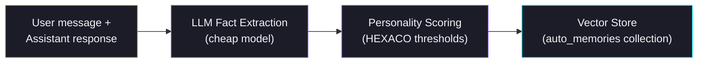

# Memory Auto-Ingest Pipeline

After every conversation turn, the auto-ingest pipeline uses a cheap LLM (gpt-4o-mini or claude-haiku) to extract structured facts from the exchange and store them in the agent's vector database. This runs non-blocking so it never slows down the conversation.

## What It Does

The pipeline watches each user–assistant exchange, sends it through LLM-as-judge fact extraction, scores each fact's importance against a personality-derived threshold, and persists qualifying facts into the `auto_memories` vector collection for future retrieval.

## How It Works



1. **Extract** — The LLM receives the latest turn and outputs candidate facts, each tagged with a category and raw importance score (0–1).
2. **Score** — The personality scoring layer modulates raw importance using the agent's HEXACO traits (see below).
3. **Filter** — Facts below the importance threshold (default 0.4) are discarded.
4. **Deduplicate** — Remaining facts are compared against existing memories via cosine similarity (default threshold 0.85). Near-duplicates are dropped.
5. **Store** — Qualifying facts are embedded and written to the `auto_memories` vector collection with metadata (category, importance, timestamp, source turn).

## Fact Categories

| Category | What it captures |
|----------|-----------------|
| `user_preference` | Likes, dislikes, stated preferences |
| `episodic` | What happened in the conversation |
| `goal` | What the user wants to achieve |
| `knowledge` | Technical or domain facts learned |
| `correction` | Corrections to prior beliefs or statements |

## HEXACO Personality Modulation

Each HEXACO trait adjusts which categories get boosted, the importance threshold, and extraction volume:

| Trait (> 0.6) | Effect |
|---------------|--------|
| **Openness** | Lowers importance threshold (catches more marginal facts), +1 max facts per turn, enables emotional context tracking |
| **Conscientiousness** | Boosts `goal` and action-item importance, tighter deduplication (0.92), more frequent compaction |
| **Agreeableness** | Boosts `user_preference` importance, increases retrieval topK by 2 |
| **Emotionality** | Enables sentiment tracking, boosts `episodic` and emotional context categories |
| **Honesty** | Boosts `correction` category priority, loosens deduplication (0.75) to preserve nuance |

The modulation is automatic — derived from the agent's `personality` block in `agent.config.json`. No manual tuning required.

## Configuration

Add a `storage.autoIngest` section to `agent.config.json`:

```json
{
  "storage": {
    "autoIngest": {
      "enabled": true,
      "importanceThreshold": 0.4,
      "maxPerTurn": 3
    }
  }
}
```

| Key | Default | Description |
|-----|---------|-------------|
| `enabled` | `true` | Toggle the pipeline on/off |
| `importanceThreshold` | `0.4` | Minimum importance score to store a fact (before personality modulation) |
| `maxPerTurn` | `3` | Maximum facts extracted per conversation turn |

## Integration Points

The pipeline is wired into two entry points:

- **CLI chat** (`wunderland chat`) — runs after each assistant response via the `afterTurn()` hook in `AgentStorageManager`.
- **Chat runtime API** (`/api/chat`) — triggered by the same hook when conversations run through the HTTP API.

## Relationship to Observer / Reflector

The auto-ingest pipeline and the Observer/Reflector system are complementary but operate differently:

| | Auto-Ingest | Observer / Reflector |
|---|---|---|
| **Trigger** | Every turn | Token threshold (30K / 40K) |
| **Granularity** | Per-turn fact extraction | Batch observation + consolidation |
| **LLM cost** | Cheap model, small prompt | Larger prompt with conversation history |
| **Output** | Individual facts in vector store | Observation notes + long-term memory traces |
| **Purpose** | Capture details before they scroll out of context | Compress and consolidate accumulated knowledge |

Both systems feed the same retrieval pipeline — auto-ingested facts are surfaced by RAG queries alongside Observer/Reflector traces, scored by the same composite retrieval formula (vector similarity, Ebbinghaus strength, emotional congruence, recency, graph activation, importance).

## Key Files

| File | Purpose |
|------|---------|
| `packages/wunderland/src/storage/MemoryAutoIngestPipeline.ts` | Pipeline orchestrator |
| `packages/wunderland/src/storage/PersonalityMemoryConfig.ts` | HEXACO-to-config mapping |
| `packages/wunderland/src/storage/AgentStorageManager.ts` | Wires pipeline into afterTurn() |
