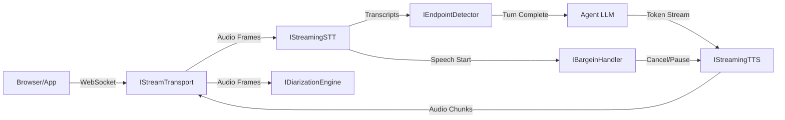
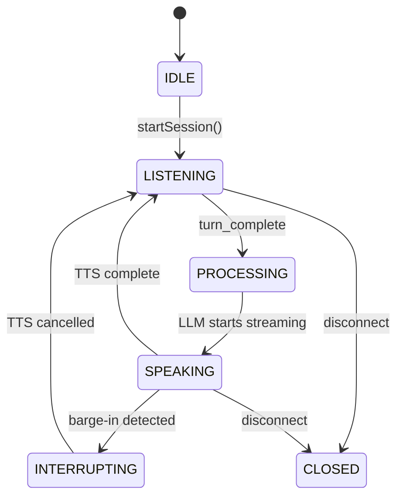

# Streaming Voice Pipeline

AgentOS provides a real-time streaming voice pipeline for building conversational voice agents. The pipeline handles bidirectional audio streaming, speech-to-text, turn-taking, text-to-speech, speaker diarization, and barge-in detection.

## Architecture

The pipeline consists of 6 core interfaces wired together by the `VoicePipelineOrchestrator`:



## State Machine

The orchestrator manages a conversational loop through these states:



## Quick Start

### CLI

```bash
# Basic voice mode (Whisper STT + OpenAI TTS)
wunderland chat --voice

# Deepgram + ElevenLabs
wunderland chat --voice \
  --voice-stt deepgram \
  --voice-tts elevenlabs \
  --voice-diarization
```

Install the matching streaming voice packs and set the required API keys before
using `--voice`:

- `@framers/agentos-ext-streaming-stt-whisper` + `OPENAI_API_KEY`
- `@framers/agentos-ext-streaming-stt-deepgram` + `DEEPGRAM_API_KEY`
- `@framers/agentos-ext-streaming-tts-openai` + `OPENAI_API_KEY`
- `@framers/agentos-ext-streaming-tts-elevenlabs` + `ELEVENLABS_API_KEY`

`semantic` endpointing also requires an LLM callback to be wired into the
pipeline; when that callback is absent, Wunderland falls back to heuristic
endpointing.

### Configuration

In `agent.config.json`:

```json
{
  "voice": {
    "enabled": true,
    "pipeline": "streaming",
    "stt": "deepgram",
    "tts": "elevenlabs",
    "ttsVoice": "nova",
    "endpointing": "heuristic",
    "diarization": {
      "enabled": true,
      "expectedSpeakers": 2
    },
    "bargeIn": "hard-cut",
    "language": "en-US",
    "server": {
      "port": 8765,
      "host": "127.0.0.1"
    }
  }
}
```

CLI flags override config file values.

## Core Interfaces

| Interface | Purpose |
|-----------|---------|
| `IStreamTransport` | Bidirectional audio pipe (WebSocket now, WebRTC later) |
| `IStreamingSTT` | Real-time speech-to-text with interim results |
| `IEndpointDetector` | Turn-taking: decides when the user is done speaking |
| `IDiarizationEngine` | Speaker identification and labeling |
| `IStreamingTTS` | Token-stream to audio synthesis |
| `IBargeinHandler` | Handles user interruption during agent speech |

## Endpointing Modes

| Mode | How it works | Latency | Cost |
|------|-------------|---------|------|
| `acoustic` | Pure energy-based VAD + silence timeout | Highest (~3s) | Free |
| `heuristic` | Punctuation/syntax analysis + silence fallback | Low (~0.5s for `. ? !`) | Free |
| `semantic` | LLM classifier for ambiguous pauses | Lowest (smart) | LLM API call per ambiguous turn |

## Barge-in Modes

| Mode | Behavior |
|------|----------|
| `hard-cut` | Immediately cancel TTS after 300ms of user speech. Injects `[interrupted]` marker into conversation history. |
| `soft-fade` | Fade TTS over 200ms. If user speaks < 2s (backchannel), resume. If > 2s, cancel. |
| `disabled` | Agent speaks to completion regardless of user speech. |

## Extension Packs

| Pack | npm Package | Provider | Env Var |
|------|------------|----------|---------|
| Deepgram STT | `@framers/agentos-ext-streaming-stt-deepgram` | Deepgram Nova-2 | `DEEPGRAM_API_KEY` |
| Whisper STT | `@framers/agentos-ext-streaming-stt-whisper` | OpenAI Whisper | `OPENAI_API_KEY` |
| OpenAI TTS | `@framers/agentos-ext-streaming-tts-openai` | OpenAI TTS-1 | `OPENAI_API_KEY` |
| ElevenLabs TTS | `@framers/agentos-ext-streaming-tts-elevenlabs` | ElevenLabs | `ELEVENLABS_API_KEY` |
| Diarization | `@framers/agentos-ext-diarization` | Local x-vector | — |
| Semantic Endpoint | `@framers/agentos-ext-endpoint-semantic` | Any LLM | LLM API key |

## WebSocket Protocol

The voice server communicates via WebSocket:

- **Binary messages**: Raw audio (client→server: PCM Float32 mono; server→client: encoded mp3/opus)
- **Text messages**: JSON control/metadata

### Client → Server

```typescript
// Text messages
{ type: 'config', sampleRate: 16000, voice: 'nova', language: 'en-US' }
{ type: 'control', action: 'mute' | 'unmute' | 'stop' }

// Binary messages: raw PCM Float32 mono audio
```

### Server → Client

```typescript
{ type: 'session_started', sessionId: '...', config: { sampleRate: 24000, format: 'opus' } }
{ type: 'transcript', text: 'Hello', isFinal: false, speaker: 'Speaker_0' }
{ type: 'agent_thinking' }
{ type: 'agent_speaking', text: 'Hi there!' }
{ type: 'agent_done' }
{ type: 'barge_in', action: 'cancelled' }
{ type: 'session_ended', reason: 'disconnect' }

// Binary messages: encoded audio (mp3/opus) in negotiated format
```

## Error Recovery

| Failure | Recovery |
|---------|----------|
| STT connection drops | Auto-reconnect with exponential backoff (100ms → 5s). Audio frames buffered during reconnect. |
| TTS connection drops | Cancel current utterance, re-create session, re-send buffered text. |
| Transport disconnects | Tear down all sessions. Client must reconnect. |
| Endpoint stuck | 30s watchdog timer forces `turn_complete`. |
| Diarization lag | Non-blocking. Transcript sent to LLM immediately; speaker labels backfilled. |

## Known Limitations

The voice pipeline is functional but has these known limitations that will be addressed in future releases:

### No True Incremental LLM Streaming

The current `chat --voice` implementation gets the full LLM text reply first, then chunks it for TTS. This means:
- First audio playback is delayed until the LLM finishes generating
- Barge-in cannot cancel in-flight LLM generation — only TTS playback
- Future: wire a real streaming text-turn API from the chat runtime into `IVoicePipelineAgentSession`

### Semantic Endpointing Requires LLM Callback

The semantic endpoint detector (`@framers/agentos-ext-endpoint-semantic`) only invokes the LLM turn-completeness classifier when an explicit `llmCall` callback is provided. Without it, the detector falls back to heuristic endpointing (punctuation + silence timeout).

### Telephony Media Stream Bridge Incomplete

The `telephony-webhook-server.ts` handles webhook routing and call control but does not yet automatically bridge provider media streams (Twilio `<Stream>`, Telnyx streaming, Plivo Audio Stream) into `TelephonyStreamTransport` and the voice pipeline. The media stream WebSocket connection must be established separately.

### Env-Based Provider Resolution

The `SpeechProviderResolver` and `createStreamingPipeline()` currently resolve voice components based on environment variables and static configuration. Future versions will resolve through a real `ExtensionManager` runtime with dynamic pack loading and hot-swapping.

### No Call Recording or Transcript Persistence

Call transcripts are held in memory during the call but are not persisted to storage after the call ends. Future: integrate with AgentOS storage/memory system.
